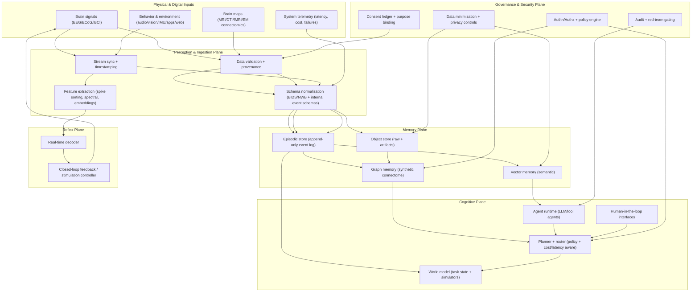
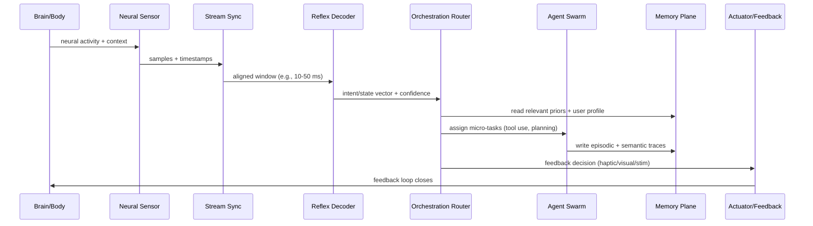
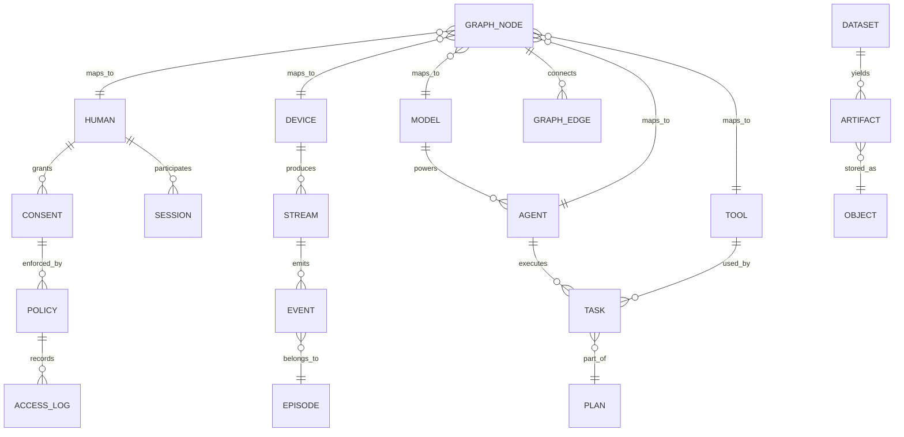
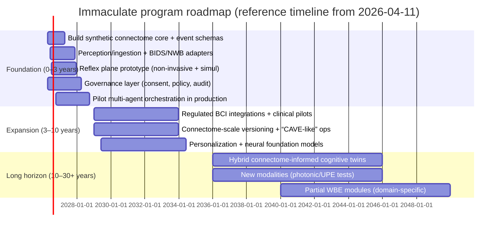

# Immaculate Program Engineering Report

## Authorship And Program Role

**Program owner:** Gaetano Comparcola  
**Role:** Program originator, systems architect, and engineering lead
**Monocole / bio site:** [PossumX.dev](https://PossumX.dev)

**Architected and engineered contributions**
- Defined the three-plane operating model across reflex, cognitive, and offline execution.
- Set the build doctrine that Immaculate must be durable, observable, replayable, benchmarked, and operator-controlled before it scales outward.
- Directed the synthetic connectome, live harness, TUI, dashboard, and phased orchestration substrate toward a control-system-first architecture rather than a model-first architecture.

## Executive Summary

This report designs and engineers **Immaculate**: a practical, buildable, future‑proof architecture that unifies (a) brain mapping pipelines, (b) brain–computer interface (BCI) streaming and control loops, (c) multi‑agent AI orchestration, and (d) a **synthetic connectome**—a “digital connectome of intelligence” that models and optimizes how humans, models, tools, and agents interact.

**Key assumptions (explicit):** no fixed constraints on budget, team size, deployment footprint, or governance model beyond legality and consent; the architecture therefore includes “lean prototype” and “planetary‑scale” reference deployments, and calls out where costs/latencies become dominated by physics or regulation.

**Reality boundaries (important):**
- **Full human mind emulation from scans is not currently achievable.** Whole brain emulation (WBE) roadmaps emphasize major uncertainties: what biological detail is functionally necessary, the feasibility of scanning at required resolution, and the compute/bandwidth/storage needed to run and validate an emulation. citeturn3view0turn4view3
- However, **partial, data‑driven neural emulation and “digital twin” methods are already real** at smaller scales (e.g., millimeter‑scale cortical volumes). The MICrONS effort makes the case that ~1 mm³ of mammalian brain tissue at synaptic resolution implies ~petabyte‑scale raw imagery and demands industrialized versioning/collaboration tools. citeturn5view0turn26view0
- **BCI throughput has crossed a threshold where “high‑bandwidth human–AI coupling” is viable in practice**, at least for communication and control. Peer‑reviewed results include unconstrained sentence decoding at **~62 words per minute** (speech neuroprosthesis) and bimanual QWERTY typing reaching **~110 characters per minute (~22 WPM)** in an intracortical BCI typing system. citeturn1search0turn22view0
- The **Immaculate bet** is therefore not “upload a mind next year,” but: build a scalable orchestration substrate that can (1) ingest brain data streams and brain maps, (2) progressively improve decoding/control and personalization, (3) integrate connectomic knowledge where available, and (4) evolve toward richer modalities as sensing improves.

**Core architectural decisions (the “Immaculate Stack”):**
1. **Three-plane system**: a real-time **Reflex Plane** (sub‑10–100 ms closed loops where required), a **Cognitive Plane** (agent orchestration, memory, reasoning; ~100 ms–seconds), and an **Offline Learning Plane** (hours–weeks training, large-scale graph optimization, connectome analytics).
2. **Synthetic connectome as first-class infrastructure**: a versioned property graph capturing nodes (humans, sensors, agents, models, tools, datasets) and edges (communication, trust, authority, dependency, causality, cost, latency). This graph becomes the system’s “nervous system wiring diagram.”
3. **Data standards and reproducibility**: use established neuroscience standards for input and archiving (e.g., BIDS for imaging; NWB for neurophysiology) and adopt versioning principles from large connectomics infrastructure (materialized snapshots + lineage/deltas). citeturn2search0turn2search13turn26view0
4. **Privacy/consent-by-design**: neurodata is treated as highly sensitive by default, with explicit authorization, auditability, revocation, and least-privilege access. This aligns with emerging governance guidance specific to neurotechnology as well as general health/privacy regimes. citeturn15search1turn15search4turn14search4turn14search5turn9search0

**A practical near-term path:**
- Start with **non-invasive and clinical-grade streams** + public connectomics datasets to harden ingestion, memory, orchestration, and governance.
- Add **implanted BCI integration only under regulated clinical pathways**, guided by regulatory expectations for implanted BCI device testing and study design. citeturn15search3turn15search7
- Use connectome-scale systems (versioned annotation, lineage, snapshots) as the blueprint for how the synthetic connectome and its policies evolve over time. citeturn26view0

## Scientific and Technical Foundations

Immaculate spans multiple “scales of truth” in neuroscience—each with different sensor physics, data rates, error modes, and scientific meaning.

image_group{"layout":"carousel","aspect_ratio":"16:9","query":["diffusion MRI tractography human connectome visualization","fMRI resting state brain network map","electron microscopy connectomics segmentation neuroglancer visualization","intracortical microelectrode array in brain schematic"],"num_per_query":1}

**Macro-scale mapping (human brain connectivity and function):**
- Large-scale human mapping programs emphasize multimodal imaging (structural MRI, resting/task fMRI, diffusion MRI) collected with standardized protocols and pipelines, producing “connectivity” at the network/tract level rather than synapse-by-synapse wiring. citeturn8search8turn8search24turn8search0
- This scale supports **parcellations, tractography, and functional connectivity graphs**—valuable as priors and personalization anchors for BCIs and cognitive models, but not sufficient for “mind upload.”

**Micro-/meso-scale connectomics (synaptic wiring and cellular identity):**
- Synaptic-resolution reconstructions exist for smaller organisms and partial brains. The adult fly “hemibrain” connectome paper reports ≈25k neurons in that dataset and demonstrates how dense reconstructions become a complete computational object, not just a figure. citeturn0search2
- For mammalian tissue volumes, MICrONS highlights the scale barrier: millimeter-scale reconstructions involve ~petabyte raw imagery and hundreds of millions of synaptic connections, enabling structure–function pairing at unprecedented resolution. citeturn5view0turn7view0
- Connectomics is also a **data lifecycle problem**: proofreading edits and annotations change the “truth” over time. CAVE (Connectome Annotation Versioning Engine) formalizes this with reproducible querying across time via snapshots and lineage/delta logic; it explicitly states that ~10 nm imagery for ~1 mm³ takes ~1 PB. citeturn26view0

**BCI state of the art (practical bandwidth into AI systems):**
- Implanted BCIs are advancing rapidly, with major differences across modalities:
  - **Penetrating intracortical arrays** support high-resolution spiking signals (high bandwidth, higher invasiveness).
  - **ECoG/sEEG** and **endovascular** approaches trade resolution for invasiveness and deployment feasibility.
- Communication BCIs specifically have achieved high performance:
  - Unconstrained sentence decoding at ~62 WPM (speech neuroprosthesis). citeturn1search0
  - Bimanual typing at ~110 characters/min (~22 WPM) with low error rates in intracortical BCI participants; the paper also describes use of pre‑operative fMRI and connectome-style pipelines for targeting, illustrating how macro mapping feeds implant placement and decoding. citeturn22view0
- Regulatory reality: the U.S. implanted BCI guidance explicitly frames implanted BCI devices as neuroprostheses interfacing with nervous systems and provides nonclinical/clinical study considerations—Immaculate must treat implanted BCI integration as a regulated medical domain. citeturn15search3turn15search7

**Neurodata standards (future-proof ingestion and interchange):**
- **BIDS** was created to standardize organizing/describing MRI datasets to improve sharing and pipeline automation. citeturn2search0turn2search16
- **NWB** provides a common data standard for neurophysiology (electrophysiology, optical physiology, tracking/stimuli), and its ecosystem framing emphasizes reproducible sharing across tools and archives. citeturn2search5turn2search13
- Extensions exist for intracranial EEG (iEEG-BIDS) covering sEEG/ECoG/DBS raw data organization. citeturn2search20

**Closed-loop timing constraints (BCI and neurostimulation):**
- Real-time systems matter: ONIX reports **2 GB/s throughput** and **<1 ms closed-loop latencies** in an open-source acquisition platform, demonstrating that sub-millisecond “reflex” loops are technically achievable at the acquisition layer in experimental settings. citeturn13search2turn2search7
- Reviews of BCI closed‑loop systems commonly highlight low-latency needs (often framed as <100 ms) depending on task and feedback modality. citeturn13search1

**Baseline biological scale (for sizing and humility):**
- The human brain contains on average ~86 billion neurons (and comparable non-neuronal cells) per isotropic scaling analyses. citeturn0search13turn0search9
- WBE discussions compile a wide range of compute/storage estimates and emphasize uncertainty over which modeling “levels” are sufficient; the roadmap explicitly calls for “falsifiable design” with experiments that reduce uncertainty. citeturn3view0turn4view3

**Plausible fringe modalities (treated seriously, evaluated rigorously):**
- **Photonic waveguiding in myelinated axons**: theoretical modeling suggests myelinated axons could serve as photonic waveguides and proposes in vivo/in vitro tests. citeturn16search9turn16search1
- **Ultraweak photon emission (UPE / biophotons)**: UPE is reported across biological systems; some recent work explores extracranial UPE as an “optical marker” of brain activity. citeturn16search0turn16search16
- **Active skepticism is warranted**: a 2026 preprint specifically revisits claims of extracranial “brain UPE” detection and argues that previously reported magnitudes/interpretations may suffer from serious methodological issues under proper dark conditions. citeturn16search3turn16search13
- **Quantum microtubule consciousness (Orch‑OR)**: both the proposal and serious critiques exist in peer-reviewed venues; Tegmark’s decoherence-based critique and subsequent responses illustrate the current state: speculative, contested, and not an engineering dependency. citeturn18search5turn18search0turn17search6turn17search7
- For Immaculate, these fringe channels are best treated as **optional sensor modalities** with explicit falsification tests—not as core assumptions.

## Reference Architecture

Immaculate is designed as a **unified orchestration organism** whose “body” is distributed compute + sensors, whose “nervous system” is the synthetic connectome graph, and whose “cortex” is multi-agent reasoning plus memory.

### System overview diagram



**Why this structure matches the science:**
- Connectomics and brain mapping produce **huge, evolving datasets** that must be queried reproducibly over time—CAVE’s snapshot+lineage approach is a direct precedent for versioned truth in Immaculate’s synthetic connectome. citeturn26view0
- Millimeter-scale connectomics already involves petabyte order raw data; therefore, architecture must explicitly separate raw object storage from higher-level graph/materialized views. citeturn5view0turn26view0
- BCIs require a distinct **Reflex Plane** for millisecond-to-100ms loops; ONIX demonstrates sub‑millisecond closed-loop capability at acquisition scale. citeturn13search2turn2search7

### Data-flow chart for a closed-loop BCI-assisted agent action



**Latency and correctness principle:** the Reflex Plane produces **fast, bounded** outputs (intent vectors, confidence), while the Cognitive Plane produces **slower, higher-value** planning—this prevents unstable “LLM-in-the-loop” oscillations in millisecond control.

## Component-Level Specifications

This section gives actionable specifications for each subsystem, including interfaces, schemas, and candidate implementation technologies (with comparative tables).

### Perception and ingestion layer

**Primary responsibilities**
- **Time and synchronization** across heterogeneous streams (BCI + behavior + system telemetry).
- **Quality control**: detect dropped samples, clock drift, sensor saturation, and artifact bursts.
- **Provenance**: every derived artifact must bind to raw sources, processing version, and consent scope.
- **Normalization** into stable internal schemas plus archiving into canonical neuroscience formats.

**Required capabilities (actionable)**
- Timestamp accuracy targets:
  - Prototype: ≤2 ms cross-stream alignment for EEG/behavior.
  - Implanted iBCI reflex loops: ≤0.5–1 ms internal pipeline jitter for the Reflex Plane when feasible (best-effort, task-dependent), using acquisition systems capable of sub‑ms closed-loop behavior as precedent. citeturn13search2
- Streaming throughput targets:
  - Handle 10–100 MB/s per participant for high-channel implanted systems (order-of-magnitude sizing based on typical channel counts and kHz sampling; the exact rate depends on compression and whether spikes vs raw broadband are streamed). Neural interface whitepapers describe “high-bandwidth” intent and thousands-of-channel directions as a goal. citeturn21search1

**Neuroscience file standards for ingestion/archival**
- Imaging: adopt BIDS conventions for MRI dataset organization. citeturn2search0turn2search16
- Neurophysiology: adopt NWB for electrophysiology/optical physiology and related time series. citeturn2search5turn2search13
- Intracranial EEG: optionally adopt iEEG-BIDS when operating on raw iEEG datasets. citeturn2search20

### Memory plane

Immaculate requires **three complementary memory types** because brains and orchestration systems do not “remember” as a single store.

**Semantic memory (vector store)**
- Purpose: similarity search for concepts, past solutions, user preferences, and learned latent states.
- Operational requirement: fast approximate nearest-neighbor queries, hybrid filtering, and multi-tenant separation.

**Graph memory (synthetic connectome)**
- Purpose: explicit relational memory of “who/what connects to what,” including authority, provenance, trust, cost, latency, and causal links.
- Versioning requirement: graph changes must be queryable “as of time T,” mirroring connectomics collaboration needs described by CAVE (arbitrary time point queries; snapshot/delta logic). citeturn26view0

**Episodic memory (append-only log + time-indexed store)**
- Purpose: immutable event history of perceptions, decisions, tool calls, messages, errors, and outcomes.
- Critical feature: allows reproducibility, audits, and learning from failures; mirrors the need for versioned truth in large collaborative datasets. citeturn26view0

### Reasoning agents

**Agent types (minimum set)**
- **Reflex agents**: deterministic or bounded decoders/controllers (no free-form language generation) used in time-critical control loops.
- **Cognitive agents**: planners, researchers, tool users, summarizers; can be LLM-driven.
- **Guardrail agents**: safety/policy checkers; treat guardrails as independent from the agents they supervise.
- **Meta-optimization agents**: propose rewiring of the synthetic connectome based on measured outcomes.

**Agent runtime requirements**
- Streaming outputs (partial progress) and persistence for long-running workflows (multi-hour tasks).
- Deterministic replay of decision traces for audit and debugging (especially important when neural data and consent constraints are involved).

### Orchestration and routing

**Routing model**
- Inputs: intent vectors, task requests, policy constraints, latency budgets, cost budgets, and resource availability.
- Output: a task graph assigning work to agents/services/humans with deadlines and rollback semantics.

**Hard reliability requirement**
- Immaculate should not be “best effort chat.” It must behave like a durable distributed system: retries, idempotency, state checkpoints, and exactly-once semantics where feasible (especially for actions that affect the world or a person).

### Self-optimization engine

Immaculate’s “learning” is not only model training; it is **system rewiring**.

**Optimization loops**
- **Policy optimization**: which agent/tool sequence yields best outcome under constraints.
- **Resource optimization**: scheduling and placement to reduce latency/cost.
- **Graph plasticity**: adjust edge weights and routing rules in the synthetic connectome based on observed success/failure.

**Ground truth**
- Success metrics must be explicitly defined per domain: BCI accuracy/latency, user satisfaction, task completion, safety violations, cost per outcome, etc.

### Human BCI interfaces

Immaculate treats BCIs as **bi-directional interfaces**: read (decode intent/state), and write (feedback/stimulation/assistive outputs).

**High-level design constraints**
- Clinical implanted BCIs fall under medical device expectations; use regulatory guidance and IRB/IDE processes. citeturn15search3turn15search7
- Because real-world performance is achievable (speech and typing neuroprostheses), Immaculate should provision production-grade pipelines for these use cases rather than treating BCIs as “R&D toys.” citeturn1search0turn22view0

### Hardware accelerators and networking

Immaculate is constrained by **(a) compute density**, **(b) memory bandwidth**, and **(c) speed-of-light latency** at global scale.

- Modern AI factory systems disclose multi‑GPU memory and interconnect bandwidth measurements that define practical ceilings for low-latency orchestration clusters; for example, published figures for high-end systems include multi‑TB/s GPU memory bandwidth and high‑TB/s intra-node GPU interconnect. citeturn13search3turn12search1turn12search0
- For global orchestration, physical distance imposes a lower bound. A standard “engineering approximation” is ~5 µs/km one-way in fiber (order-of-magnitude), making intercontinental RTTs approach ~100 ms purely from propagation. citeturn13search0

### Comparative tables of candidate technologies

These tables give candidate “drop-in” components; selection depends on maturity, licensing, compliance needs, and team expertise.

#### Brain mapping and BCI ecosystem anchors

| Domain | Candidate | Why it matters for Immaculate | Key source evidence |
|---|---|---|---|
| Macro-scale human mapping | entity["organization","Human Connectome Project","multimodal brain mapping"] | Provides multimodal imaging protocols and pipelines useful for parcellation, personalization, and targeting workflows. | Protocol pages emphasize resting/task fMRI and diffusion tractography acquisition structure. citeturn8search8turn8search24turn8search0 |
| Neuron/circuit atlases | entity["organization","BRAIN Initiative Cell Atlas Network","nih cell atlas program"] | Enables standardized cell-type references that can become priors for connectome-informed modeling and labeling. | Program description emphasizes reference brain cell atlases. citeturn8search2 |
| Multi-scale wiring diagrams | entity["organization","BRAIN CONNECTS","connectivity across scales program"] | Aligns with Immaculate’s need to unify across mapping scales and modalities. | Program explicitly targets wiring diagrams spanning entire brains across scales. citeturn8search6 |
| Millimeter-scale mammalian connectomics | entity["organization","MICrONS","iarpa connectomics program"] | Establishes the “petabyte per mm³” regime and structure–function paired datasets; key blueprint for scaling and data governance. | Program and Nature summary describe multi‑petabyte datasets, 1 mm³ scale, and the petabyte-order data requirement. citeturn7view0turn5view0 |
| Connectome collaboration/versioning | entity["organization","Connectome Annotation Versioning Engine","connectomics infra"] | Direct precedent for Immaculate’s versioned synthetic connectome: snapshots, lineage, reproducible time-point queries. | CAVE paper describes petascale datasets, ~10 nm imagery, ~1 PB raw for ~1 mm³, and arbitrary time-point queries. citeturn26view0 |
| Whole fly brain connectome community | entity["organization","FlyWire","whole fly connectome platform"] | Demonstrates community-driven whole-brain connectomics and large-scale annotation practices that generalize to synthetic connectomes. | Whole-brain adult female fly connectome framing and Nature analyses of FlyWire. citeturn8search1turn8search5turn8search17 |
| High-bandwidth implanted BCI direction | entity["company","Neuralink","brain-computer interface company"] | Illustrates scaling goals (high-channel-count, integrated platform); relevant for long-term interoperability planning. | White paper describes a scalable high-bandwidth BMI platform; company updates document early human implantation milestone. citeturn21search1turn1search10turn1search2 |
| Endovascular BCI path | entity["company","Synchron","endovascular bci company"] | Lower-invasiveness implant approach; relevant for adoption models and clinical feasibility. | JAMA Neurology case series on endovascular BCI safety/feasibility. citeturn1search11turn1search19 |
| Intracortical research ecosystem | entity["organization","BrainGate","intracortical bci clinical program"] | Provides long-running clinical trial context and published high-throughput communication work. | 2026 typing paper references the clinical trial context and performance; ClinicalTrials listing exists. citeturn22view0turn1search9 |
| Microelectrode arrays vendor ecosystem | entity["company","Blackrock Neurotech","neural interface company"] | Useful for channel-count baselines, durability claims, and integration planning. | Product documentation and related publications describe 96-electrode arrays and system configurations. citeturn21search2turn21search6 |
| Regulated pathway reference | entity["organization","U.S. Food and Drug Administration","medical device regulator"] | Defines expectations for implanted BCI testing and clinical study considerations; shapes roadmap and QA. | Implanted BCI guidance document and related pages. citeturn15search3turn15search7turn15search11 |

#### Data + orchestration building blocks

| Subsystem | Candidate | Fit for Immaculate | Primary/official sources |
|---|---|---|---|
| Distributed task/actor runtime | entity["organization","Ray","distributed ai framework"] | Actor + task model useful for agent swarms; paper reports scaling and architecture for emerging AI workloads. | OSDI paper and archive. citeturn9search1turn9search5 |
| Container orchestration | entity["organization","Kubernetes","container orchestration project"] | Standard substrate for multi-service deployment, scaling, service discovery. | Official docs describe orchestration features. citeturn28search12turn28search0 |
| Durable workflow engine | entity["organization","Temporal","workflow orchestration platform"] | Durable, resumable workflows; aligns with long-running agent tasks and audit requirements. | Official documentation describes workflow concepts and reliability. citeturn9search14turn9search2 |
| Event streaming (episodic store backbone) | entity["organization","Apache Kafka","event streaming project"] | High-throughput event log for episodic memory, telemetry, and message buses. | Official docs emphasize distributed servers/clients over TCP and streaming usage. citeturn10search0turn10search4 |
| Alternative streaming/messaging | entity["organization","Apache Pulsar","messaging and streaming project"] | Pub-sub with multitenancy patterns; useful for global-scale event routing. | Official docs describe pub-sub messaging model. citeturn11search3turn11search19 |
| RPC and IDL | entity["organization","gRPC","rpc framework"] | Strong typing and streaming RPC; good for low-latency service calls and control-plane APIs. | gRPC docs describe protocol buffers and high performance RPC. citeturn10search1turn10search5turn10search9 |
| Observability standard | entity["organization","OpenTelemetry","observability project"] | Unifies traces/metrics/logs; essential for latency budgets and debugging. | Official specification describes signals + OTLP + collector model. citeturn9search3turn9search15 |
| Policy engine | entity["organization","Open Policy Agent","policy engine project"] | Policy-as-code for consent, purpose limitation, and infra guardrails. | Official docs describe policy as code and APIs for decoupled decisions. citeturn19search2turn19search10 |
| Workload identity | entity["organization","SPIFFE","workload identity specification"] | Cryptographic identity for services; supports mTLS and workload auth patterns. | SPIFFE overview highlights SVIDs and cross-environment identities. citeturn19search1turn19search5 |
| Authorization model | entity["organization","Zanzibar","global authorization system"] | Proven global authorization logic for fine-grained access control; useful for consent-bound neurodata access. | USENIX paper and research publication describe ACL evaluation at scale. citeturn19search0turn19search4 |
| Vector DB option | entity["organization","Milvus","vector database project"] | Open-source vector DB positioning itself for scalable AI retrieval. | Documentation describes scalable vector DB positioning. citeturn10search10turn10search6 |
| Vector DB option | entity["organization","Weaviate","vector database project"] | Open-source vector DB focused on AI-native workloads and hybrid patterns. | Docs describe it as open-source AI vector database. citeturn11search0turn11search8 |
| Vector DB option | entity["organization","Qdrant","vector search project"] | Open-source vector search engine with filtering; useful for low-latency semantic retrieval. | Official docs describe open-source vector search engine. citeturn11search1turn11search13 |
| Managed vector DB | entity["company","Pinecone","managed vector database company"] | Managed architecture (control plane/data plane) fits production RAG footprints. | Docs explain managed architecture and routing planes. citeturn11search10turn11search2 |
| Graph DB | entity["company","Neo4j","graph database company"] | Mature property graph + algorithms ecosystem; fits synthetic connectome queries. | Official materials describe graph DB positioning and GDS library. citeturn10search7turn10search11 |
| Service mesh option | entity["organization","Istio","service mesh project"] | mTLS and traffic policy to enforce secure internal communication. | Docs describe mutual TLS migration and security posture. citeturn28search1turn28search17 |
| L7 proxy/data-plane option | entity["organization","Envoy","proxy project"] | L7 proxy “communication bus” patterns for microservices; useful for observability + policy. | Official docs describe Envoy as L7 proxy/communication bus. citeturn28search2turn28search6 |

#### Security reference anchors (select)

| Security/Governance need | Candidate anchor | Why it matters | Source |
|---|---|---|---|
| Zero-trust posture | entity["organization","National Institute of Standards and Technology","us standards body"] | Provides an abstract model and migration steps for Zero Trust Architecture (ZTA). | NIST SP 800-207. citeturn9search0turn9search4 |
| Neurotech norms | entity["organization","UNESCO","un agency"] | Provides global normative framework and safeguards for neurotechnology ethics. | UNESCO neurotech ethics material and 2025 adoption note. citeturn14search1turn14search5turn14search9 |
| Responsible innovation | entity["organization","Organisation for Economic Co-operation and Development","intergovernmental organization"] | Offers neurotech responsible innovation guidance and a formal recommendation. | OECD documents on responsible innovation neurotech. citeturn14search4turn14search0turn14search8 |
| US health privacy baseline | entity["organization","U.S. Department of Health & Human Services","us health department"] | HIPAA Privacy/Security Rule summaries guide handling of health/medical records in regulated contexts. | Official HIPAA summaries. citeturn15search1turn15search9turn15search5 |
| EU sensitive data framing | entity["organization","European Union","political and economic union"] | GDPR includes special categories of sensitive personal data (health, biometrics, etc.). | Official GDPR legal text PDF. citeturn15search4 |

## Protocols, Data Formats, Schemas, and Controls

This section specifies how Immaculate moves, stores, and governs data.

### Internal event protocol

Use **typed events** for everything that affects memory, routing, or actuation. The episodic store becomes the source of truth, with materialized views for speed.

**Event envelope (canonical)**
```json
{
  "event_id": "uuid",
  "event_time_utc": "RFC3339",
  "producer": { "service": "string", "instance": "string" },
  "subject": { "type": "human|agent|device|dataset", "id": "string" },
  "purpose": ["string"],
  "consent": { "policy_id": "string", "scope_hash": "string" },
  "schema": { "name": "string", "version": "semver" },
  "payload": {},
  "integrity": { "hash": "sha256", "sig": "optional" }
}
```

**Why**: connectome-scale systems show that “truth changes” and must be queryable across time; CAVE explicitly supports arbitrary time point queries despite ongoing edits. Immaculate’s episodic store + snapshotting should treat orchestration state the same way. citeturn26view0

### Synthetic connectome schema

Immaculate’s graph must represent both **structure** (static relationships) and **dynamics** (actual interactions over time). Use:
- A property graph (nodes + typed edges + properties).
- Versioned edge weights updated by self-optimization.
- “Materialized snapshots” for audit and reproducibility (daily/hourly, domain dependent), with lineage/deltas for time-travel queries (connectomics precedent). citeturn26view0

**Mermaid ER diagram**


### Recommended external interchange formats

- **Imaging**: BIDS (organizational schema) for MRI datasets. citeturn2search0turn2search16
- **Neurophysiology time series**: NWB for electrophysiology/optical physiology/behavior streams. citeturn2search5turn2search13
- **Connectomics**: store raw imagery in object storage; store segmentations/annotations in systems that support time travel and community edits—CAVE provides a concrete model (annotations bound to segment IDs at timepoints, materialization snapshots, lineage graph). citeturn26view0

### Security, privacy, consent controls

Immaculate must assume that neurodata can enable sensitive inferences; even if “reading thoughts” is often overstated, the ethical and legal stakes are high.

**Core controls**
- **Purpose binding**: every read/write must state purpose(s) and be validated against consent policy.
- **Least privilege**: deny-by-default; fine-grained access control for datasets, features, models, and actions.
- **Auditability**: append-only access logs; cryptographic integrity for critical actions.
- **Revocation**: consent revocation should prevent future access and trigger re-keying / quarantine where needed.
- **Data minimization**: store derived features when possible; retain raw where scientifically/clinically necessary.

**Reference governance anchors**
- UNESCO’s neurotech ethics framework explicitly targets technologies that “read” and “write” brain activity and calls for safeguards. citeturn14search1turn14search5turn14search9
- OECD’s recommendation and related work emphasizes stewardship, trust, safety, and privacy in neurotechnology innovation. citeturn14search4turn14search8turn14search0
- U.S. health privacy/security baselines and EU sensitive data frameworks inform compliance designs in regulated contexts. citeturn15search1turn15search9turn15search4

**Zero trust implementation approach**
- A ZTA framing (per NIST SP 800‑207) maps well to Immaculate because the system is inherently distributed (many services, many agents, many tools) and must not rely on perimeter trust. citeturn9search0turn9search4

## Scaling Analysis: Compute, Storage, Bandwidth, Latency, Cost

### Storage sizing

**Empirical anchor (connectomics):**
- CAVE states that for ~1 mm³ datasets imaged at ~10 nm resolution, raw imagery takes **~1 petabyte**. citeturn26view0
- Nature’s MICrONS overview similarly states that reconstructing ~1 mm³ requires roughly **a petabyte of data**. citeturn5view0

**Human whole-brain extrapolation (order-of-magnitude)**
- Human brain volume is on the order of ~10^3 cm³ (liter-scale); converting to mm³ gives ~10^6 mm³. If the ~1 PB/mm³ scaling held (it will vary by resolution, compression, sample prep, and imaging modality), raw imagery would be on the order of **~10^6 PB ≈ 10^3 EB ≈ ~1 ZB** for whole-brain synaptic-resolution EM. This is a back-of-the-envelope extrapolation grounded in the mm³→PB empirical anchor. citeturn26view0turn5view0

**Implication:** planetary-scale Immaculate must treat synaptic-resolution whole human connectomics as a **long-horizon** capability, and must be valuable even when using macro-scale maps and partial connectomes.

### Compute sizing

**Whole brain emulation estimates (uncertain, but instructive)**
- WBE compilations show estimates spanning orders of magnitude depending on modeling level, including ~10^15–10^18 operations/second style figures in summarized tables and discussion, explicitly emphasizing uncertainty and the need to identify the right abstraction level. citeturn4view3turn3view0

**Immaculate engineering stance**
- Treat WBE as an **offline learning and simulation workload**, not a requirement for the real-time orchestration core.
- Build interfaces so that if higher-fidelity neural simulations become practical, they can be slotted in as additional “world model” modules.

### Bandwidth sizing

**BCI streaming**
- High-channel implanted approaches aim for scalable, high-bandwidth interfaces; a foundational white paper describes a system direction toward scalable, high‑bandwidth brain–machine interfacing (details vary by implementation). citeturn21search1
- Realistic near-term ranges:
  - EEG/behavioral streams: typically KB/s to low MB/s.
  - Intracortical broadband streams (hundreds–thousands channels at kHz): typically single‑digit to tens of MB/s before compression.
- These are tractable within local networks; the global constraint is less bandwidth than **latency + privacy + reliability** (especially if raw neural signals are transmitted).

### Latency budgets

Immaculate must publish explicit latency classes:

**Reflex Plane (closed-loop)**
- Target end-to-end loop: **<100 ms** for many closed-loop BCI feedback contexts, with sub‑10 ms desirable for certain stimulation/interaction regimes depending on task; literature emphasizes low-latency demands as an enabling factor. citeturn13search1turn13search9
- Acquisition can be sub‑ms in specialized systems (ONIX reports <1 ms closed-loop latencies). citeturn13search2

**Cognitive Plane (interactive)**
- Human-interactive agent orchestration typically benefits from first-response latencies in the 100s of ms to a few seconds (not a neuroscience citation; standard UX practice), but must never block the Reflex Plane.

**Planetary scale physics**
- Fiber propagation imposes lower bounds; using the common ~3.34 µs/km in free space (and slower in fiber), one-way transoceanic paths imply tens of milliseconds, and RTTs can reach ~100 ms+ before any processing. citeturn13search0

### Cost models

Costs are highly variable and time-sensitive; Immaculate should therefore use a **parameterized cost model** rather than hard-coded assumptions.

**GPU compute (example anchor points)**
- Official published rates for some reserved/capacity constructs provide an anchor for per-accelerator hourly costs; for example, a published price sheet for a GPU capacity construct includes a per-accelerator effective hourly rate for a configuration with 8 accelerators. citeturn30search7
- Treat this as a variable: `C_gpu_hour`.

**Storage**
- Object storage bills are a function of storage volume, request rate, and data transfer; major object storage pricing pages emphasize multiple cost components (storage, requests, retrieval, transfer, management features). citeturn31view0

**Reference cost curve (conceptual)**
- Prototype: dominated by engineering salaries + modest GPU/cloud spend + secure storage.
- Production: dominated by GPU serving + high-availability storage + compliance + on-call.
- Planetary scale: dominated by datacenter capex + network corridors + governance, with major irreducible costs from replication, latency locality, and auditability.

## Phased Roadmap, Milestones, Team Roles

This roadmap is designed around *buildable increments* and *future-proof interfaces*, consistent with WBE calls for falsifiable design and uncertainty reduction. citeturn3view0

### Roadmap timeline visualization



### Milestones by horizon

**Horizon: 0–3 years (practical prototype → early production)**
- Build the **synthetic connectome core**: graph schema, versioning model, routing hooks, and audit-grade event log.
- Integrate brain data as **first-class streams** using standards:
  - imaging ingestion organized with BIDS conventions citeturn2search0  
  - neurophysiology ingestion organized with NWB citeturn2search5
- Implement a **CAVE-inspired** model for “truth over time”: materialized snapshots + lineage/delta queries for both neuro-derived graphs and orchestration graphs. citeturn26view0
- Validate Reflex Plane timing with open acquisition systems where possible (sub‑ms acquisition precedent). citeturn13search2
- Demonstrate target user outcomes:
  - closed-loop neurofeedback tasks,
  - assistive communication prototypes modeled on published performance regimes (speech/typing). citeturn1search0turn22view0

**Horizon: 3–10 years (regulated integrations + scale)**
- Establish clinical partnerships and fully regulated pathways for implanted BCI integrations; follow implanted BCI guidance expectations. citeturn15search3turn15search7
- Expand connectome-informed priors (macro-scale connectivity + partial connectomes).
- Deploy multi-region orchestration with locality-aware routing, recognizing speed-of-light constraints. citeturn13search0

**Horizon: 10–30+ years (hybrid cognitive twins + new modalities)**
- Hybrid systems blending:
  - macro connectomes,
  - patient-specific neural decoding,
  - partial synaptic connectomes where feasible.
- Run falsification programs for speculative modalities (see next section).

### Team roles and hiring profile (founding → scaling)

A minimal founding team for a credible build typically spans five pillars:

1. **Neuroengineering lead**: BCI signal processing, closed-loop systems, experimental design.
2. **Neuroscience/data lead**: brain mapping standards, connectomics pipelines, labeling/priors; familiarity with datasets and versioned annotation systems. citeturn26view0turn5view0
3. **Distributed systems lead**: event streaming, workflow engines, multi-region reliability, observability. citeturn10search0turn9search14turn9search3
4. **ML/agents lead**: multi-agent architectures, retrieval systems, evaluation, and model serving.
5. **Security/Privacy/Governance lead**: consent systems, ZTA deployment, compliance in neurotech and health contexts. citeturn9search0turn14search5turn15search1turn15search4

## Risk Analysis and Mitigation

### Scientific risks

**Unknown “sufficient detail” for mind-level modeling**
- WBE sources emphasize uncertainty about which biological scale separation is sufficient; there may be no single clean separation that preserves mind function in a tractable model. citeturn3view0turn4view3  
**Mitigation:** treat WBE as a research track; require falsifiable incremental milestones (partial emulations, domain-limited digital twins) rather than “human upload” claims. citeturn3view0

**Interpretability risk in connectome → function**
- Even with connectivity, function depends on dynamics; MICrONS is valuable because it pairs anatomy with functional recordings. citeturn5view0turn7view0  
**Mitigation:** design Immaculate to fuse structure + function + behavior, not structure alone.

### Engineering risks

**Data scale blowups**
- Petabyte-per-mm³ anchors imply ZB-class raw data for whole human synaptic EM; naive “store everything hot” designs fail. citeturn26view0turn5view0  
**Mitigation:** tiered storage, aggressive lifecycle management, and a graph/materialization strategy where most workflows operate on derived/condensed artifacts.

**Real-time instability**
- Mixing nondeterministic agents into millisecond control can cause oscillations/harm.  
**Mitigation:** strict Reflex Plane isolation; deterministic controllers; safety envelopes; simulation-first validation.

### Ethical, legal, governance risks

**Neuroprivacy and coercion**
- UNESCO’s neurotechnology ethics work explicitly warns about technologies that “read/write” brain activity and requires safeguards; OECD guidance centers stewardship and privacy. citeturn14search1turn14search5turn14search4  
**Mitigation:** purpose binding, consent ledger, revocation, audit logs, and “refuse-by-default” for new uses until reviewed.

**Regulatory noncompliance**
- Implanted BCIs are regulated medical devices; FDA has explicit guidance for implanted BCI device testing and clinical considerations. citeturn15search3turn15search7  
**Mitigation:** separate product lines: (a) research platform, (b) clinical/medical platform with full QMS, IDE/IRB, and post-market commitments.

**Cross-jurisdiction complexity**
- GDPR special-category data constraints and health data regulations impose strict conditions on processing; U.S. health privacy standards set a baseline for PHI handling in covered contexts. citeturn15search4turn15search1  
**Mitigation:** data localization options, modular compliance controls, and policy-as-code enforced at every access path.

## Speculative Sections: Plausibility Evaluations and Experimental Tests

Immaculate can include fringe modalities only if they come with explicit **plausibility grading** and **testable experimental plans**.

### Photonic signaling and optical waveguides in axons

**Claim class:** theoretical plausibility + limited empirical grounding  
- Modeling work suggests myelinated axons could act as photonic waveguides and proposes experiments. citeturn16search9turn16search1

**Engineering implication for Immaculate**
- Treat as an optional sensor channel: “optical modality plug-in” in the Perception Plane.
- Do not assume it carries meaningful cognitive bandwidth until experiments show signal-to-noise and task relevance.

**Falsification tests (actionable)**
- In vitro: inject photons at defined wavelengths into isolated myelinated axon preparations; measure transmission loss/scatter under physiological conditions and compare to model predictions. citeturn16search9
- In vivo (preclinical): correlate optical emissions or guided signals with known electrophysiological events; demand replication across labs.

### Ultraweak photon emission (UPE) as brain activity marker

**Claim class:** observed phenomenon + contested interpretation  
- UPE is explored as an optical marker of brain activity in recent work. citeturn16search0turn16search16
- A 2026 critique argues reported extracranial “brain UPE” measurements may be much weaker under proper dark conditions and that some interpretations face serious methodological issues. citeturn16search3turn16search13

**Engineering implication**
- If pursued, UPE sensing must be treated like a **high-risk measurement channel** with strict calibration, dark-count controls, and confound auditing (temperature, scalp/hair, motion, ambient photons).

**Falsification tests**
- Double-blind, shielded dark-room protocols with independent replication and cross-validation against established neural markers (EEG/fMRI tasks), and explicit reporting of detector dark counts and control surfaces. citeturn16search3turn13search9

### Distributed consciousness hypotheses

**Claim class:** philosophical + computationally testable system behavior  
- Mainstream consciousness theories (global workspace, integrated information) are active research areas, with both supportive arguments and critiques. citeturn18search2turn17search0turn18search3

**Immaculate stance**
- Immaculate should not claim to “create consciousness,” but it can experimentally study **global workspace-like dynamics** in multi-agent systems:
  - shared broadcast memory,
  - attention/priority routing,
  - competition/cooperation patterns,
  - persistent self-model components.

**Measurable tests**
- Define “workspace events” in the synthetic connectome (broadcast nodes), measure whether they improve multi-agent coordination and robustness under noise/partial failure—analogous to the purpose global workspace theories assign to conscious access. citeturn18search2turn17search5

### Quantum microtubule theories (Orch‑OR)

**Claim class:** highly speculative, scientifically contested  
- Decoherence-based critiques argue brain-relevant degrees of freedom are effectively classical on cognitive timescales; responses argue assumptions matter. citeturn18search5turn17search7
- Peer-reviewed critiques argue Orch‑OR is not scientifically justified. citeturn17search6turn17search2

**Engineering implication**
- Immaculate should not depend on Orch‑OR. If explored at all, it is a research topic with clear, independently verifiable predictions (e.g., microtubule coherence signatures) and strict experimental controls.

## Prioritized Research Agenda and Bibliography

### Prioritized research agenda (what to read, build, and test first)

**Connectomics-to-infrastructure translation**
- Reproduce a **CAVE-like governance model** in the synthetic connectome: snapshots, lineage graphs, materialization, and arbitrary time-point queries. citeturn26view0turn8search3
- Build a “MICrONS-inspired” digital twin workflow: pair functional streams + structural priors in a unified dataset registry and query layer. citeturn5view0turn7view0

**BCI integration research**
- Implement two reference decoders:
  1) speech-decoding-style sequence model evaluation harness (benchmark against 62 WPM regime); citeturn1search0  
  2) typing-decoding-style continuous bimanual decoding harness (benchmark against 110 chars/min regime). citeturn22view0
- Establish an FDA-aligned development plan for implanted BCI modules (nonclinical testing, study design, risk management). citeturn15search3turn15search7

**Neurodata standardization**
- Adopt BIDS and NWB in the ingestion plane; build validation tools and round-trip export pipelines so Immaculate is interoperable with the neuroscience ecosystem. citeturn2search0turn2search13

**Governance and privacy**
- Implement policy-as-code and ZTA patterns from the start; neurotech governance standards are converging and reputational risk is existential. citeturn9search0turn14search5turn14search4

**Speculative modality experiments (optional, gated)**
- Photonic waveguide tests and UPE measurement replication under strict controls, explicitly incorporating the 2026 critique as a design constraint. citeturn16search9turn16search3

### Bibliography of primary/official sources used (selected)

- Sandberg & Bostrom, “Whole Brain Emulation: A Roadmap” (technical report) — establishes WBE requirements, uncertainty mapping, and compute/storage estimate ranges. citeturn3view0turn4view3  
- MICrONS program description and Nature overview — multi‑petabyte datasets, mm³ scale, and the ~petabyte per mm³ framing. citeturn7view0turn5view0  
- CAVE (Nature Methods) — versioning, arbitrary time-point queries, ~10 nm imagery, and ~1 PB raw imagery for ~1 mm³ datasets. citeturn26view0  
- Peer-reviewed BCI performance results — speech neuroprosthesis (~62 WPM) and intracortical typing (~110 chars/min). citeturn1search0turn22view0  
- BIDS and NWB standards — canonical data organization and neurophysiology storage ecosystems. citeturn2search0turn2search13  
- FDA implanted BCI device guidance — regulatory expectations for devices in paralysis/amputation contexts. citeturn15search3turn15search7  
- NIST SP 800‑207 — Zero Trust Architecture framing for distributed systems. citeturn9search0turn9search4  
- UNESCO neurotechnology ethics materials and adoption notice — global normative safeguards for neurotechnology. citeturn14search1turn14search5  
- OECD neurotechnology responsible innovation recommendation and supporting material — governance principles for neurotech. citeturn14search4turn14search0turn14search8  
- Photonic/biophoton speculative literature with critiques — axon waveguide modeling, UPE exploration, and the 2026 critique of extracranial claims. citeturn16search9turn16search0turn16search3
